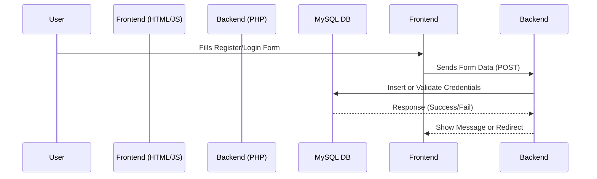

# 🩸 Life Link — Saving Lives, One Link at a Time

**Life Link** is a social-impact web platform created by **Team Aarambh** to address urgent blood donation needs. It bridges the gap between **individual blood donors**, **hospitals**, and **blood banks** through a location-based, role-driven, and easy-to-use platform.

It ensures critical blood requirements are met quickly by enabling real-time alerts, fast registration, and effective matching between patients in need and potential donors.

---

## 🌐 Hosted Demo

🔗 **Live Website**: [https://aarambh-xcza.vercel.app](https://aarambh-xcza.vercel.app)  
📄 **Project Presentation**: Viewable in the [GitHub repository](https://github.com/Failureguy94/Aarambh/blob/main/Blood%20Donation%20Network%20%E2%80%93%20Connects%20blood%20donors%20with%20hospitals%20and%20patients%20_20250406_234819_0000.pdf)

---

## 🎯 Purpose & Problem Statement

Every year, thousands of lives are lost due to delayed blood availability. Despite the presence of donors, the lack of a centralized, efficient, and trustworthy system prevents timely donations.

### Life Link solves this by:
- Creating a verified network of donors, hospitals, and blood banks
- Enabling users to sign up based on their roles
- Tracking donor willingness and eligibility
- Providing alerts for urgent requests

---

## 🧠 How It Works

### 👤 User Roles:
- **Individual Donors**: Can register, provide blood type, and specify willingness to donate. If eligible, they may be contacted during shortages.
- **Hospitals**: Can post blood requests, manage urgency, and view potential donors.
- **Blood Banks**: Can register available units and assist in coordinating with nearby hospitals.

### 🔁 Workflow Overview

1. A user lands on the platform and selects their role (Donor, Hospital, or Blood Bank)
2. They complete the role-specific registration form (capturing relevant details)
3. Information is stored securely in a **MySQL database** via a **PHP backend**
4. On login, users are redirected to a **Dashboard** showing role-specific data
5. In emergencies, hospitals can trigger requests which notify donors (future scope)
6. System tracks donor eligibility (based on last donation date)

---

## 🔐 Authentication & Validation

- Input validation (email, phone, passwords, checkbox agreement)
- Passwords are **hashed** before storing in the database
- Session-based login & dashboard access
- JavaScript-based form validation with user-friendly error messages

---

## 🛠️ Tech Stack

| Layer       | Tools Used |
|-------------|------------|
| **Frontend** | HTML5, CSS3, JavaScript |
| **Backend**  | PHP (via XAMPP server) |
| **Database** | MySQL (phpMyAdmin) |
| **Hosting**  | Vercel (Frontend), Localhost (Backend) |
| **Auth**     | Form login, password hashing, session storage |

---

## 🧱 Database Schema (MySQL)

```sql
CREATE TABLE users (
  id INT AUTO_INCREMENT PRIMARY KEY,
  user_type ENUM('individual', 'hospital', 'bloodbank') NOT NULL,
  first_name VARCHAR(100),
  last_name VARCHAR(100),
  email VARCHAR(100) UNIQUE,
  phone VARCHAR(20),
  password VARCHAR(255),
  blood_group VARCHAR(5),
  date_of_birth DATE,
  address TEXT,
  hospital_name VARCHAR(150),
  hospital_id VARCHAR(100),
  hospital_address TEXT,
  hospital_city VARCHAR(100),
  hospital_contact_person VARCHAR(100),
  bloodbank_name VARCHAR(150),
  bloodbank_license_no VARCHAR(100),
  bloodbank_address TEXT,
  bloodbank_city VARCHAR(100),
  bloodbank_capacity INT,
  willing_to_donate BOOLEAN DEFAULT 0,
  last_donation_date DATE,
  created_at TIMESTAMP DEFAULT CURRENT_TIMESTAMP
);
```

---

## 📂 Folder Structure (Backend + Frontend)

```
/aarambh/
├── fronty.html          # Home / Landing page
├── loginpage.html       # Combined login & registration UI
├── signup-page.html     # Alternative login page
├── db.php               # MySQL DB connection file
├── register.php         # Handles role-based user registration
├── login.php            # Validates login and manages sessions
├── dashboard.php        # User-specific post-login view
├── logout.php           # Destroys session
├── README.md            # Project documentation
└── assets/              # Images, logo, styles
```

---

## 📈 System Flow (Login/Register)



---

## 🔔 Features Summary

- [x] Role-based user registration (individual, hospital, blood bank)
- [x] Location & blood group selection
- [x] Dashboard redirection after login
- [x] Donor consent + last donation tracking
- [x] Validations for phone, email, password strength
- [ ] Admin panel (coming soon)
- [ ] Notification system (in progress)
- [ ] Geolocation filtering (future)

---

## 🧪 Sample Users for Testing (Optional)

| Email | Password | Role |
|-------|----------|------|
| donor@example.com | donor123 | Individual |
| hospital@example.com | hospital123 | Hospital |
| bank@example.com | bank123 | Blood Bank |

*(Only valid if you’ve added these in the database manually)*

---

## 🚀 Future Enhancements

- 📍 Geolocation-based nearest donor search
- 📞 SMS & email notification service
- 🏥 Hospital inventory dashboard
- 🔔 Firebase real-time emergency push alerts
- 🫀 Organ donor registration module

---

## 👥 Team Aarambh

Built during the Code Kshetra hackathon as a submission under the SDG-3 challenge (Good Health and Well-being).  
Team members include developers, designers, and planners aligned to solve real-world healthcare logistics.

---

## 📜 License

This project is licensed under the [MIT License](LICENSE). Feel free to fork, clone, and contribute!

